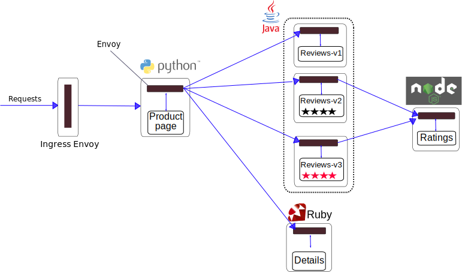

# Chaos Engineering

#### Definition

Chaos Engineering is the discipline of experimenting on a system in order to build confidence in the system's capability to withstand turbulent conditions in production environment

#### Before we start

In order to implement chaos engineering experiments, we have to do it:

* In production environment
* Get enough time to understand your application and its dependencies
* Have observability on the system (Monitoring - Alerting - Tracing ...)

#### Terminology

* Experiment: An experiment is a sequence of tasks to apply on the systems in order to destroy parts of it
* Steady-state hypothesis: The steady state is the state of the system before and after running the experiment, if they match, we conclude that our system is resilient and highly available

#### Process

* Create your experiment
* Define the steady-state hypothesis 
* Run the experiment 
* Create reports

#### Tools

In this section, we will demonstrate a list of most powerful tools in the market, and we will choose our weapon.

| Tool              | Scope        | Documentation | Open-source/Free | Community |
|-------------------|--------------|---------------|------------------|-----------|
| Manual Chaos      | All          | None          | Yes              | None      |
| Customize scripts | All          | None          | Yes              | None      |
| Chaos Monkey      | AWS          | Good          | Yes              | Good      |
| Simian Army       | AWS          | Good          | Yes              | Good      |
| Gremlin           | Wide         | Good          | No               | Good      |
| Powerful Seal     | K8s          | Poor          | Yes              | Poor      |
| kube-monkey       | K8s          | Poor          | Yes              | Poor      |
| Litmuschaos       | K8s          | Poor          | Yes              | Poor      |
| Glooshot          | Service Mesh | Poor          | Yes              | Poor      |
| Chaos toolkit     | Wide         | Good          | Yes              | Good      |

After comparing all available tools, Chaos toolkit seems to be the complete tool to choose, it can be used for different components, it's free, open source, and have good documentation

#### Setting up the environment

The following tools needs to be installed before we start experimenting on our system:

* Git
* Helm
* Python3
* Pip

#### Installing chaos toolkit

Install python3

On Debian like systems

```
# apt install python3 python3-env
```

On RHEL systems

```
# yum install python3
```

Create a python virtual environment

```
# python3 -m venv ~/venvs/chaostk
```

Install chaostoolkit binary

```
# cd ~/venvs/chaostk && ./bin/pip3 install -U chaostoolkit
# cp ./bin/chaos /usr/local/bin/
```

To test if chaos toolkit is installed

```
# chaos version
```

## Experimenting kubernetes

Before starting our experiments, we have to deploy a chaostoolkit driver called 'chaostoolkit-kubernetes'

```
# cd ~/venvs/chaostk && ./bin/pip3 install -U chaostoolkit-kubernetes
```

To list all the tasks that this plugin can perform, we will use the 'discover' option

```
# chaos discover chaostoolkit-kubernetes
```

Or reffer to the following link:

[chaostoolkit-kubernetes Docuentation](https://docs.chaostoolkit.org/drivers/kubernetes/)

#### Testing Controllers

* First of all, we will test if our application is deployed using kubernetes controllers by terminating application instances

Note: Before running our experiment, we have to define the steady state of our application

In the following experiment, we have six sections:

* Version: Current version of chaostoolkit API 
* Title: Title of our experiment
* Description: Description of our experiment
* Tags: Used to organize experiments
* Steady-state-hypothesis: The state of our application, in this case, we are checking wether a pod exists or no
* Method: In the method section, we will terminate a random pod that has 'app=demo' label, and we will pause the expermient before checking wether the pod exists or no  

```
version: 1.0.0
title: What happens if we terminate a Pod?
description: If a Pod is terminated, a new one should be created in its places.
tags:
- k8s
- pod
steady-state-hypothesis:
  title: Pod exists
  probes:
  - name: pod-exists
    type: probe
    tolerance: 1
    provider:
      type: python
      func: count_pods
      module: chaosk8s.pod.probes
      arguments:
        label_selector: app=demo
        ns: demo
method:
- type: action
  name: terminate-pod
  provider:
    type: python
    module: chaosk8s.pod.actions
    func: terminate_pods
    arguments:
      label_selector: app=demo
      rand: true
      ns: demo
  pauses: 
    after: 10
```

- In all our examples, we will be using a demo called app, in a namespace called demo

- If the experiment fails, we have to use a controller to deploy our applications, kubernetes deployments is the ultimate solution to keep our application in an existing status.

- Checking wheter a pod exists or no is not enough in kubernetes, as you know, a pod may exists, and not be in a running state, so we will push our experiment further, and we will check if the pods are in a 'Running' state.

```
version: 1.0.0
title: What happens if we terminate a Pod?
description: If a Pod is terminated, a new one should be created in its places.
tags:
- k8s
- pod
steady-state-hypothesis:
  title: Pod exists
  probes:
  - name: pod-exists
    type: probe
    tolerance: 1
    provider:
      type: python
      func: count_pods
      module: chaosk8s.pod.probes
      arguments:
        label_selector: app=demo
        ns: demo
  - name: pod-in-phase
    type: probe
    tolerance: true
    provider:
      type: python
      func: pods_in_phase
      module: chaosk8s.pod.probes
      arguments:
        label_selector: app=demo
        ns: demo
        phase: Running
  - name: pod-in-conditions
    type: probe
    tolerance: true
    provider:
      type: python
      func: pods_in_conditions
      module: chaosk8s.pod.probes
      arguments:
        label_selector: app=demo
        ns: demo
        conditions:
        - type: Ready
          status: "True"
method:
- type: action
  name: terminate-pod
  provider:
    type: python
    module: chaosk8s.pod.actions
    func: terminate_pods
    arguments:
      label_selector: app=demo
      rand: true
      ns: demo
  pauses: 
    after: 10

```
Deploying ann application using a replication controller with one instance will cause a downtime when the single instance goes down, a better way is to use kubernetes horizontal pod autoscaler 'HPA' and create more than one instance. 

Even the usage of kubernetes controllers and checking the status of the pod are not enough to make sure that our application is up and running, another way to test our application is to send an HTTP request and check the status code.

In the following example we will destroy a random pod of our application and send an HTTP request to test the high availability of our application.

```
version: 1.0.0
title: What happens if we terminate an instance of the application?
description: If an instance of the application is terminated, the applications as a whole should still be operational.
tags:
- k8s
- pod
- http
configuration:
  ingress_host:
      type: env
      key: INGRESS_HOST
steady-state-hypothesis:
  title: The app is healthy
  probes:
  - name: app-responds-to-requests
    type: probe
    tolerance: 200
    provider:
      type: http
      timeout: 3
      verify_tls: false
      url: http://${ingress_host}/

method:
- type: action
  name: terminate-app-pod
  provider:
    type: python
    module: chaosk8s.pod.actions
    func: terminate_pods
    arguments:
      label_selector: app=demo
      rand: true
      ns: demo
  pauses: 
    after: 2
```

Note: this experiment contains an environment variable which needs to be exported before running the experiment

```
# export ingress_host='X.X.X.X'
```

#### Destroying application dependencies

In this example, while we are still working on our demo application, we will destroy an instance of the database server and observe how the application acts.

We will use the same method 'HTTP Requests' to test the application while destroying the database instance

```
version: 1.0.0
title: What happens if we terminate an instance of the DB?
description: If an instance of the DB is terminated, dependant applications should still be operational.
tags:
- k8s
- pod
- http
configuration:
  ingress_host:
      type: env
      key: INGRESS_HOST
steady-state-hypothesis:
  title: The app is healthy
  probes:
  - name: app-responds-to-requests
    type: probe
    tolerance: 200
    provider:
      type: http
      timeout: 3
      verify_tls: false
      url: http://${ingress_host}/
      
method:
- type: action
  name: terminate-db-pod
  provider:
    type: python
    module: chaosk8s.pod.actions
    func: terminate_pods
    arguments:
      label_selector: app=demo-db
      rand: true
      ns: demo
  pauses: 
    after: 2
```

## Destroying Network

In this section, we will test our service mesh network resiliency, our experiments will focus on the following areas:

* Partial network failure
* Network latency
* Full network failure
* Denial of service attacks

By default, istio supports fault injection, in order to test our application resiliency, chaostoolkit uses this capability under the hood, to implement chaos experiments, the driver that we will be using is `chaostoolkit-istio`

To discover tthis driver's capabilities, please reffer to the following link:

[chaostoolkit-istio Documentation](https://docs.chaostoolkit.org/drivers/istio/)

In order to install istio driver:

```
$ pip install -U chaostoolkit-istio
```

#### Partial network failure 

In this first part, we will abort natwork traffic partially between two services of our application, and we will see our application behaviour.

NB: In this part, we will applying our experiments on the 'Bookinfo' application, you can deploy it via [Bookinfo](https://istio.io/latest/docs/examples/bookinfo/)

The bookinfo application has the following architecture



We will be aborting 50% of requests from 'productpage' service to 'details' service.

Our first experiment will look like this:

```
version: 1.0.0
title: What happens if we abort responses
description: If responses are aborted, the dependant application should retry and/or timeout requests
tags:
- k8s
- istio
- http
configuration:
  ingress_host:
      type: env
      key: INGRESS_HOST
steady-state-hypothesis:
  title: The app is healthy
  probes:
  - type: probe
    name: app-responds-to-requests
    tolerance: 200
    provider:
      type: http
      timeout: 5
      verify_tls: false
      url: http://${ingress_host}/productpage
  - type: probe
    tolerance: 200
    ref: app-responds-to-requests
  - type: probe
    tolerance: 200
    ref: app-responds-to-requests
  - type: probe
    tolerance: 200
    ref: app-responds-to-requests
  - type: probe
    tolerance: 200
    ref: app-responds-to-requests
method:
- type: action
  name: abort-failure
  provider:
    type: python
    module: chaosistio.fault.actions
    func: add_abort_fault
    arguments:
      virtual_service_name: bookinfo
      http_status: 500
      routes:
        - destination:
            host: details
      percentage: 50
      version: networking.istio.io/v1alpha3
      ns: default
  pauses:
    after: 1
rollbacks:
- type: action
  name: remove-abort-failure
  provider:
    type: python
    func: remove_abort_fault
    module: chaosistio.fault.actions
    arguments:
      virtual_service_name: bookinfo
      routes:
        - destination:
            host: details
      version: networking.istio.io/v1alpha3
      ns: default
```

* Version: The version of the API
* Title: Title of the experiment
* Description: description of the experiment
* Tags: Used to organize experiments code
* Configuration: Used to inject environment variables
* Steady-state-hypothesis: Describes the perfect status of the system before and after the experiment, here, we will request the application through HTTP, and we expect to get 200 code as a return.
* Method: The method used to abort requests, in this case, chaostoolkit will modify the bookinfo virtualservice so it returns a 500 code for 50% of the traffic.
* Rollbacks: Used to instruct chaostoolkit to rollback the changes done to `Bookinfo` virtualservice.

To run the experiment:

```
chaos run chaos/abort-network-partially.yaml
```

If the experiment fails, it means that our application is not resilient to partial network failure.

To fix this issue, we will use the 'retry' feature, this will instruct istio to retry the requests coming from 'productpage' to 'details' service as many times as we wants.

NB: This should not be a huge value, to avoid flooding our network.

To do so, we will add the following section to our virtual service

```
spec:
  hosts:
  - details
  http:
  - route:
    - destination:
        host: details
    retries:
      attempts: 3
      perTryTimeout: 2s
      retryOn: 5xx
```

#### Inrease Network Latency

In the second experiment, we will simulate a network delay instead of total failure of requests.

Our new experiment is:

```
version: 1.0.0
title: What happens if we abort and delay responses
description: If responses are aborted and delayed, the dependant application should retry and/or timeout requests
tags:
- k8s
- istio
- http
configuration:
  ingress_host:
      type: env
      key: INGRESS_HOST
steady-state-hypothesis:
  title: The app is healthy
  probes:
  - type: probe
    name: app-responds-to-requests
    tolerance: 200
    provider:
      type: http
      timeout: 15
      verify_tls: false
      url: http://${ingress_host}/productpage
  - type: probe
    tolerance: 200
    ref: app-responds-to-requests
  - type: probe
    tolerance: 200
    ref: app-responds-to-requests
  - type: probe
    tolerance: 200
    ref: app-responds-to-requests
  - type: probe
    tolerance: 200
    ref: app-responds-to-requests
method:
- type: action
  name: abort-failure
  provider:
    type: python
    module: chaosistio.fault.actions
    func: add_abort_fault
    arguments:
      virtual_service_name: bookinfo
      http_status: 500
      routes:
        - destination:
            host: details
      percentage: 50
      version: networking.istio.io/v1alpha3
      ns: go-demo-8
- type: action
  name: delay
  provider:
    type: python
    module: chaosistio.fault.actions
    func: add_delay_fault
    arguments:
      virtual_service_name: bookinfo
      fixed_delay: 15s
      routes:
        - destination:
            host: details
      percentage: 50
      version: networking.istio.io/v1alpha3
      ns: default
  pauses:
    after: 1
rollbacks:
- type: action
  name: remove-abort-failure
  provider:
    type: python
    func: remove_abort_fault
    module: chaosistio.fault.actions
    arguments:
      virtual_service_name: go-demo-8
      routes:
        - destination:
            host: details
            subset: primary
      version: networking.istio.io/v1alpha3
      ns: go-demo-8
- type: action
  name: remove-delay
  provider:
    type: python
    func: remove_delay_fault
    module: chaosistio.fault.actions
    arguments:
      virtual_service_name: bookinfo
      routes:
        - destination:
            host: details
            subset: primary
      version: networking.istio.io/v1alpha3
      ns: default
```

In this experiment, we have a new function called 'add_delay_fault' which will delay 50% of the traffic for 15s.

Surely, this experiment will fail because of the changes we did in our virtual service from the last experiment.

To fix this, we will add a small portion of configuration to our virtual service

```
    retries:
      attempts: 10
      perTryTimeout: 2s
      retryOn: 5xx,connect-failure
    timeout: 10s
```

This instructs istio to retry on the connection failures caused by the delay in addition to the 500 return code we put from the last experiment.

In this case, istio will retry requests every 2 seconds for 10 times, unless we set a global timeout `10s in this case`.

#### Total Network Failures

In this experiment, we will simulate a total failure of the network, by aborting 100% of the traffic between the frontend and `details` microservice.

```
version: 1.0.0
title: What happens if we abort responses
description: If responses are aborted, the dependant application should retry and/or timeout requests
tags:
- k8s
- istio
- http
configuration:
  ingress_host:
      type: env
      key: INGRESS_HOST
steady-state-hypothesis:
  title: The app is healthy
  probes:
  - type: probe
    name: app-responds-to-requests
    tolerance: 200
    provider:
      type: http
      timeout: 5
      verify_tls: false
      url: http://${ingress_host}/productpage
  - type: probe
    tolerance: 200
    ref: app-responds-to-requests
  - type: probe
    tolerance: 200
    ref: app-responds-to-requests
  - type: probe
    tolerance: 200
    ref: app-responds-to-requests
  - type: probe
    tolerance: 200
    ref: app-responds-to-requests
method:
- type: action
  name: abort-failure
  provider:
    type: python
    module: chaosistio.fault.actions
    func: add_abort_fault
    arguments:
      virtual_service_name: bookinfo
      http_status: 500
      routes:
        - destination:
            host: details
      percentage: 100
      version: networking.istio.io/v1alpha3
      ns: default
  pauses:
    after: 1
rollbacks:
- type: action
  name: remove-abort-failure
  provider:
    type: python
    func: remove_abort_fault
    module: chaosistio.fault.actions
    arguments:
      virtual_service_name: bookinfo
      routes:
        - destination:
            host: details
      version: networking.istio.io/v1alpha3
      ns: default
```

The only difference between this experiment and the partial network failure's experiment is the following line:

```
      percentage: 100
```

To run the experiment 

```
chaos run chaos/total-network-failure.yaml
```

Unfortunatly, to deal with this situation, we have to do it at the code level, showing custom static pages to clients or indicating that the service x is not available but you can still use service y, 

These failures may be at the hardware level, which cannot be resolved at the software level

#### Denial Of Service Attacks

In this experiment, we will simulate a Denial Of Service attack, by sending a hight amount of requests to our application, and we will check if our application still responds.

We will bu using a new chaostoolkit provider called 'process', such a powerfull provider that allows us to run commands that chaostoolkit drivers doesn't support.

In this case, we will run a pod inside kubernetes that sends requests to our application

```
version: 1.0.0
title: What happens if we abort responses
description: If responses are aborted, the dependant application should retry and/or timeout requests
tags:
- k8s
- pod
- deployment
- istio

steady-state-hypothesis:
  title: The app is healthy
  probes:
  - type: probe
    name: app-responds-to-requests
    tolerance: 200
    provider:
      type: http
      timeout: 5
      verify_tls: false
      url: http://192.168.111.170/productpage

method:
- type: action
  name: abort-failure
  provider:
    type: process
    path: kubectl
    arguments:
    - run
    - siege
    - --namespace
    - default
    - --image
    - yokogawa/siege
    - --generator
    - run-pod/v1
    - -it
    - --rm
    - --
    - --concurrent
    - 10
    - --time
    - 20S
    - "http://192.168.111.170/productpage"
  pauses:
    after: 5
```

Running this experiment, is similar to running the following command

```
kubectl run siege --namespace default --image yokogawa/siege --generator run-pod/v1 -it --rm -- --concurrent 100 --time 20S "http://192.168.111.170/productpage"
```

This image will send 100 concurrent requests to our application for 20 seconds.

NB: 100 requests is used only for demo purpose, in production environment, this must be a higher value

There are many solutions we can implement to solve this issue  , such as `Circuit breakers` and `Ban source IPs`.

## Chaos at kubernetes nodes level

Deploy the application 

```
# kubectl apply -f k8s/app-db
```

Our first experiment will be to drain a random node fro the cluster and check wether our application is still responds or no, the goal here is to check if our cluster is designed to survive node failures, which is a common case in the cloud ecosystem.

```
version: 1.0.0
title: What happens if we drain a node
description: All the instances are distributed among healthy nodes and the applications are healthy
tags:
- k8s
- deployment
- node
configuration:
  node_label:
      type: env
      key: NODE_LABEL
steady-state-hypothesis:
  title: Nodes are indestructible
  probes:
  - name: all-apps-are-healthy
    type: probe
    tolerance: true
    provider:
      type: python
      func: all_microservices_healthy
      module: chaosk8s.probes
      arguments:
        ns: demo
method:
- type: action
  name: drain-node
  provider:
    type: python
    func: drain_nodes
    module: chaosk8s.node.actions
    arguments:
      label_selector: ${node_label}
      count: 1
      pod_namespace: demo
      delete_pods_with_local_storage: true
  pauses: 
    after: 1
```
 
To run the experiment

```
# chaos run node-drain.yaml
```

A better way to create chaos experiments is always to rollback the damage we create, in order to make our system running again, that's why we will add a rollback section to our experiment.

```
version: 1.0.0
title: What happens if we drain a node
description: All the instances are distributed among healthy nodes and the applications are healthy
tags:
- k8s
- deployment
- node
configuration:
  node_label:
      type: env
      key: NODE_LABEL
steady-state-hypothesis:
  title: Nodes are indestructible
  probes:
  - name: all-apps-are-healthy
    type: probe
    tolerance: true
    provider:
      type: python
      func: all_microservices_healthy
      module: chaosk8s.probes
      arguments:
        ns: go-demo-8
method:
- type: action
  name: drain-node
  provider:
    type: python
    func: drain_nodes
    module: chaosk8s.node.actions
    arguments:
      label_selector: ${node_label}
      count: 1
      pod_namespace: go-demo-8
      delete_pods_with_local_storage: true
  pauses: 
    after: 1
rollbacks:
- type: action
  name: uncordon-node
  provider:
    type: python
    func: uncordon_node
    module: chaosk8s.node.actions
    arguments:
      label_selector: ${node_label}
```

The last section is used to make the node available again to host pods again

NB: In order to run this experiment, we have to have at least a cluster of two worker nodes, and two replicas of istio-gateway.

Rerun the experiment:

```
chaos run uncordon-node.yaml
```

After draining the node, we checked that our application is still up & running, the goal is to design our cluster in a way that it runs always under 60% of its capacity, so when a node is down, we don't lose our applications.

We can push our experiment further, and delete a node completly:

```
version: 1.0.0
title: What happens if we delete a node
description: All the instances are distributed among healthy nodes and the applications are healthy
tags:
- k8s
- deployment
- node
configuration:
  node_label:
      type: env
      key: NODE_LABEL
steady-state-hypothesis:
  title: Nodes are indestructible
  probes:
  - name: all-apps-are-healthy
    type: probe
    tolerance: true
    provider:
      type: python
      func: all_microservices_healthy
      module: chaosk8s.probes
      arguments:
        ns: demo
method:
- type: action
  name: delete-node
  provider:
    type: python
    func: delete_nodes
    module: chaosk8s.node.actions
    arguments:
      label_selector: ${node_label}
      count: 1
      pod_namespace: demo
  pauses: 
    after: 10
```

If we respect the `60%` rule in our design, deleting a node will not impact our applications, but we need to implement `autoscaling` in our cluster so if a cluster is removed, it will be recreated automatically

The 3 big public clouds support creating k8s clusters with autoscaling, even VMWARE hypervisors, but we need admin privileges on the 'ESXI' itself.

A final recommendation is to create our cluster in a multi `Availability Zones`, so if one goes down, our cluster will continue working.

## Reporting chaos experiments

When running an expeiment, we can a specify a `journal` file to store the test's result by adding `--journal-path` option, ex:

```
chaos run chaos/http.yaml --journal-path journal-http.json
```

Once having a journal in a `json` format, we can convert it into a more readeable format, in our case, it will be pdf.

Chaostoolkit uses some python libraries to generate reports, 


